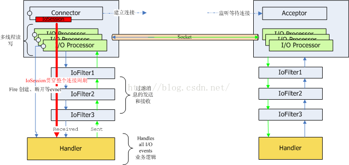

## MINA
APACHE MINA 测试项目  

## MINA简介
Apache Mina是一个能够帮助用户开发高性能和高伸缩性网络应用程序的框架。它通过Java NIO技术基于TCP/IP和UDP/IP协议提供了抽象的、事件驱动的、异步的API。简单的说，可以用它来帮助我们快速的开发网络通信

## MINA工作原理图  

## MINA阅读
[MINA官方地址](http://mina.apache.org/mina-project/index.html)  
[MINA示例1](https://blog.csdn.net/u010870890/article/details/47256741)  
[MINA示例2](https://blog.csdn.net/zouyzou/article/details/78497308)   
[MINA示例3](https://blog.csdn.net/kkk0526/article/details/51732437)